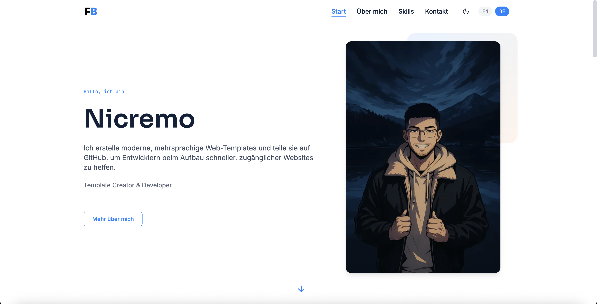

# Astro Multilingual Portfolio Template

[](https://opensource.org/licenses/MIT)
[](https://astro.build)
[](https://tailwindcss.com)

A modern, lightning-fast portfolio website template built with Astro and Tailwind CSS. Showcase your work with multilingual support, dark/light mode, and optimized performance.



## Features

- Modern Design - Clean, professional, and customizable
- Fully Responsive - Mobile-first approach for all devices
- Dark/Light Mode - Automatic theme switching with manual toggle
- Multilingual Support - Built-in English and German with easy expansion
- Lightning Fast - Astro's static site generation (90+ Lighthouse score)
- SEO Optimized - Built-in meta tags and optimized assets
- Accessibility - WCAG 2.1 AA compliant
- Easy Content Management - Update content through JSON files
- Performance Optimized - Compressed images and minimal JavaScript

## Included Sections

- Navigation - Header with language switcher
- Hero - Introduction with photo and call-to-action
- Values/Approach - Professional values showcase
- Skills & Tools - Expertise display across categories
- Projects - Project showcase with details
- Experience Timeline - Professional journey display
- Contact - Contact information with action buttons
- Legal Pages - Imprint and privacy policy (GDPR compliant)

## Tech Stack

- [Astro](https://astro.build/) - Static site generator
- [Tailwind CSS](https://tailwindcss.com/) - Utility-first CSS framework
- [GSAP](https://greensock.com/gsap/) - Animation library
- [AOS](https://michalsnik.github.io/aos/) - Scroll animations

## Getting Started

### Prerequisites

- Node.js 16 or higher
- npm or yarn

### Installation

1. Clone this repository
```bash
git clone https://github.com/nicremo/astro-multilingual-portfolio-template.git
cd astro-multilingual-portfolio-template
```

2. Install dependencies
```bash
npm install
```

3. Run the development server
```bash
npm run dev
```

4. Open your browser at `http://localhost:4321`

## Customization

### Personal Information

Update your contact information in `src/utils/me.ts`:
- Name, Homepage URL, LinkedIn username, GitHub username

Base64 encoded fields (see comments in `me.ts` for encoding instructions):
- Email, Phone, Address

Update content in:
- `astro.config.mjs` and `robots.txt` - Replace site URL
- `src/i18n/en.json` and `src/i18n/de.json` - All text content
- `src/assets/` - Replace with your images (logos, profile photo, favicon)

### Theme Colors

Modify `tailwind.config.mjs` to change colors:

```js
theme: {
  extend: {
    colors: {
      primary: '#3B82F6',
      secondary: '#1F2937',
      accent: '#10B981',
    }
  }
}
```

### Adding Projects

Edit the project section in language files:

```json
"projects": {
  "projectName": {
    "shortDescription": "Brief description",
    "challenge": "The problem solved",
    "approach": "Your solution approach",
    "result": "Outcome and impact"
  }
}
```

### Adding Languages

1. Create new language file in `src/i18n/` (e.g., `fr.json`)
2. Copy structure from `en.json` and translate
3. Update language switcher component

## Deployment

Build for production:

```bash
npm run build
```

Deploy to:
- [Netlify](https://netlify.com) - Continuous deployment from GitHub
- [Vercel](https://vercel.com) - Simple deployment for personal projects
- [GitHub Pages](https://pages.github.com) - Free hosting from repository

## License

This project is licensed under the MIT License - see the [LICENSE.md](LICENSE.md) file for details.

Copyright (c) 2025 Fabian Bitzer

## Contributing

Contributions, issues and feature requests are welcome! Check the [issues page](https://github.com/nicremo/astro-multilingual-portfolio-template/issues).

---

Created by [Fabian Bitzer](https://fabian-bitzer.de)
