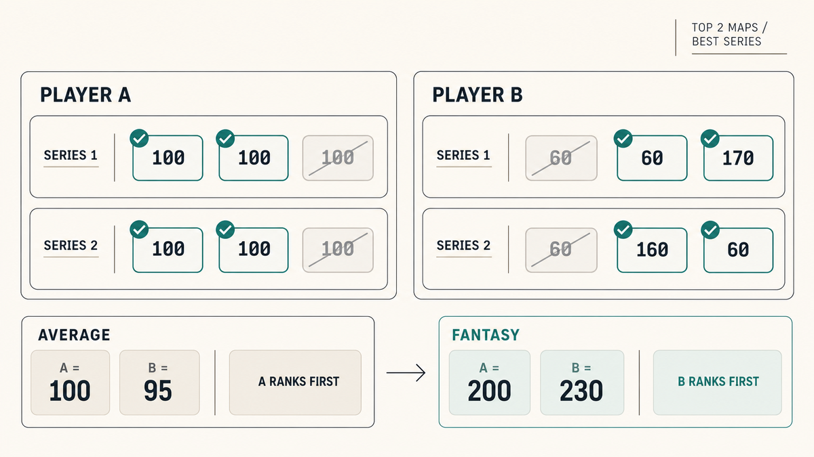
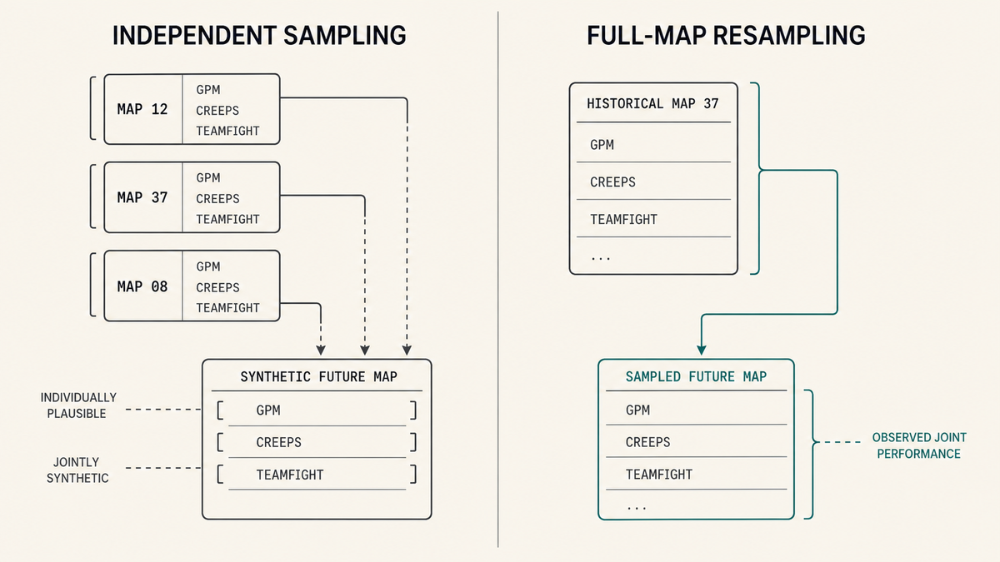
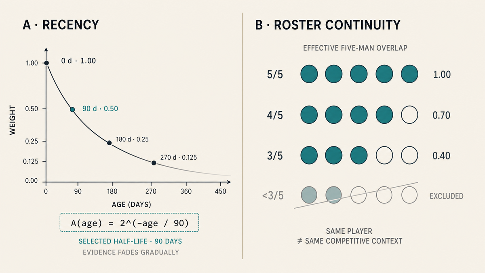
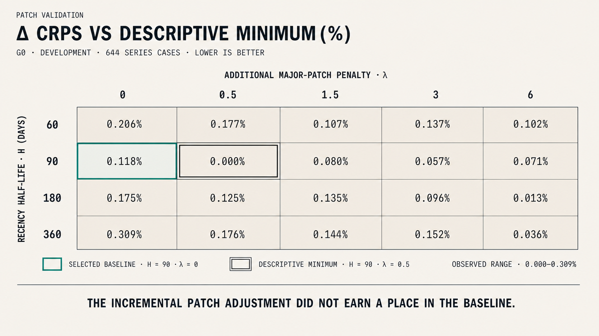

*The core forecasting choices described here were finalized before the first TI15 group-stage match. This write-up was produced after the tournament had started.*

Valve took Fantasy in an interesting direction this year. Instead of drafting five independent players, TI15 Fantasy is built around three role-specific War Banners: a Core duo, one Mid player, and a Support duo.

Each banner scores only the in-game stats attached to the Emblems you rolled, modified by their Quality and Traits, so the “best” player depends partly on the banner you actually have.

More importantly for this analysis, Fantasy does not simply accumulate every map a player plays: within a series, only the two highest-scoring maps count, and across the period only the best series survives.

Suppose you are choosing between two Fantasy players.

Player A is boringly consistent. Across six maps, he scores:

**100, 100, 100 · 100, 100, 100**

Player B is worse most of the time, but occasionally explodes:

**60, 60, 170 · 60, 160, 60**

If every map counted equally, the choice would be easy. Player A averages **100**; Player B averages **95**.

Under TI Fantasy scoring, however:

- Player A's best series is **200**.
- Player B's best series is **230**.

The ranking flips.

That simple inversion was the first clue that the problem I wanted to solve was not really *“Who is the best Fantasy player?”*

It was: **what information should I trust when trying to predict who will be the best Fantasy player?**

The more I worked on the model, the more versions of that question appeared. Can I trust an average when the scoring system rewards tails? Can I break a match into separate stat distributions without losing predictive power? How much should I trust performances from months ago, or from a different roster? And when my knowledge of Dota tells me an adjustment obviously *should* matter, what would make me remove it anyway?

Those questions ended up shaping the model more than any particular algorithm.

*Figure 1. Average performance versus Fantasy selection. Selecting the best outcomes can reverse the ranking implied by average performance.*

---

## Averages answer the wrong question

The Fantasy scoring rule can be reduced to two operations:

$$
SeriesScore = \text{sum of the two highest MapScores}
$$

$$
PeriodScore = \max(SeriesScore)
$$

That changes the object being predicted.

If every map contributed equally, a good estimate of average performance might carry most of the information I need. Once `top-k` and `max` operators repeatedly discard ordinary outcomes, the shape of the distribution starts to matter.

A player who is consistently good and a player who alternates between mediocre and exceptional maps can have similar averages while producing very different Fantasy outcomes.

> The model needed a distribution of plausible future maps, not a single number.

That does **not** make variance automatically good. A player who is terrible 99% of the time and occasionally produces an absurd outlier is not magically optimal. The useful information is in the whole distribution: where most outcomes sit, how heavy the useful tail is, and how often strong maps actually happen.

So instead of asking the model for a single number representing future performance, I wanted it to produce a **distribution of plausible future maps**.

That immediately created another problem.

How should I build that distribution?

---

### A match is more than the sum of its stats

An intuitive approach would be to model each Fantasy statistic separately.

Estimate one distribution for GPM. Another for creeps. Another for teamfight participation. Then sample each one when generating a future map.

Statistically, that is convenient. However, it made me uncomfortable.

A high-GPM performance, a huge creep score and exceptional teamfight participation are not independent pieces floating around in a player's history. They happened inside actual matches, under actual game states.

Sampling them independently can create combinations that are individually plausible but jointly artificial: GPM from one historical map, creeps from another, teamfight performance from a third.

I decided instead to keep each historical observation intact.

For a player, a historical map is represented as a complete vector $x_i$. Each eligible map receives a historical weight $w_i$, and a future map is resampled from the empirical distribution:

$$
P(X=x_i)=\frac{w_i}{\sum_j w_j}
$$

When the simulation draws a historical state, **the whole map comes with it**.

That preserves skew, zeros, correlations, nonlinear relationships and combinations that were actually observed together.

It also performed much better than collapsing the same weighted history into a point estimate. In temporal testing, full empirical player-map resampling reduced CRPS by roughly **28.7%** against that point-estimate benchmark.

The model was still relatively simple. There was no copula, no large multivariate hierarchy and no need to estimate a parametric distribution for every stat.

But the simplicity now preserved something I cared about: **the structure of a real Dota performance**.

*Figure 2. Independent stat sampling versus full-map resampling. Resampling complete maps preserves relationships that independent sampling can break.*

That solved the representation problem. It also exposed the next one.

If my future distribution is built from historical maps, **which historical maps deserve to influence it?**

---

## Not every past map deserves the same trust

> They are both observations of the same person, but treating them as interchangeable evidence is difficult to justify.

The historical dataset was built primarily from OpenDota at `player × map` granularity. OpenDota provides advanced match data extracted from Dota replays, which made it possible to keep each player's map-level performance instead of starting from tournament-level aggregates.

But a map offering real historical data does not make it automatically informative about the future.

Consider two performances from the same player.

One happened two weeks ago with the player's current five-man roster.

The other happened nine months ago, playing in a substantially different lineup.

They are both observations of the same person. However, treating them as interchangeable evidence is really difficult to justify.

### Letting evidence fade instead of expire

I did not want a rule such as *“only use the last 90 days.”*

Evidently, a map does not suddenly become worthless on day 91. Instead, I treated age as a continuous loss of relevance:

$$
A(age)=2^{-age/H}
$$

where $H$ is the half-life of historical evidence.

Temporal validation eventually settled on **$H=90$ days** as the operating point for this model. The important part was not that 90 was a magical Dota number. It was that the surrounding region was consistently stable across the development folds.

So a map 90 days old still contributes. It simply carries half the age weight of a current map. For reference, a 180-day-old map carries one quarter.

By defining this, I could keep a broad historical pool without pretending that old evidence was equally current.

### The player is not the whole context

Age was only one source of drift. Dota is a five-player system. A player's output is produced inside a roster and partly defined by this roster's dynamics.

Who absorbs farm, who starts fights, how lanes are structured, how a team distributes map resources and what kinds of games that lineup tends to create. All of that impacts how the player performs.

So I treated **effective five-man continuity** as another measure of transferability.

A historical map with the full current five-man would receive the strongest contextual weight. Four-of-five receives less. Three-of-five receives less again. Below that, I stopped treating the map as sufficiently comparable to the current team context.

Historical position was handled similarly, although more lightly: movement between nearby positions could retain most of the weight, while crossing between core and support structures was treated as incompatible. When a player's individual history became too weak, the model could progressively pool evidence from other players in the **same exact position** rather than pretend that a tiny sample was enough.

*Figure 3. Historical transferability by recency and roster continuity. A historical match becomes weaker evidence as both time and competitive context drift.*

None of these choices required pretending that there was a precise moment when the “old version” of a player became a different person.

They made a more modest statement:

**some observations are better evidence about the current player than others.**

---

## Dota knowledge creates hypotheses, not evidence

Being a huge Dota nerd, my prior knowledge started creating an almost endless list of things that *could* matter.

Tournament tier.

Opponent strength.

Historical TI behavior.

Position changes.

Roster changes.

And, perhaps most obviously, **patches**.

Major patches can change the map, economy, objectives, hero incentives, match duration, lane dynamics and the relative value of actions that directly feed Fantasy scoring.

It felt natural to assume that crossing a major patch boundary should reduce my trust in an older map beyond the normal effect of time.

So I built that possibility into the historical weight.

For every major patch boundary $b$, I estimated a shock magnitude $S_b$. A historical observation crossing one or more boundaries could then receive an additional penalty:

$$
\Gamma=e^{-\lambda\sum_b S_b}
$$

If $\lambda=0$, patches receive no additional penalty.

As $\lambda$ rises, performances separated from the current game by larger patch shocks lose more weight.

From a Dota perspective, a positive value felt like one of the safest assumptions in the model.

But that was precisely the point where I wanted domain knowledge to stop having the final vote.

Knowing Dota gave me a strong reason to **test** the hypothesis.

It did not tell me what $\lambda$ should be.

---

### When the obvious adjustment failed the test

I evaluated model choices through temporal backtesting: historical information had to predict later periods rather than being scored against the same context used to build it.

> The validation surface was flat enough that a plausible adjustment still had to earn its place.

For the probabilistic forecasts I used **CRPS — Continuous Ranked Probability Score**, a proper scoring rule for evaluating predictive distributions rather than only their expected value.

The parameter search crossed different recency half-lives with different strengths of the additional patch penalty.

Something interesting happened: The surface was very flat.

Positive patch penalties could produce tiny descriptive improvements under some configurations, but they remained inside the same practical performance basin as no additional penalty at all. Once stability across time and model simplicity were considered alongside the small differences in CRPS, the final model selected:

$$
\boxed{\lambda=0}
$$

No additional major-patch penalty beyond the ordinary recency decay.

*Figure 4. Temporal validation of recency and patch penalty. Once the existing historical controls were in place, an additional major-patch penalty did not improve enough to earn a place in the baseline.*

This was probably the most useful result in the project.

Not because I discovered that patches were irrelevant.

The narrower result was more interesting: **after accounting for the information already present in the model, the specific extra patch correction I had designed was not adding enough predictive value to justify itself.**

That distinction changed how I thought about several other ideas: it's not like I should account for many variables just because they made sense. Each variable should prove it adds enough predictive value to justify its inclusion.

> Plausibility is not enough; every variable has to earn its place.

The point was not to make the model as small as possible.

It was to stop treating *plausible* as a synonym for *useful*.

Tournament-tier weighting stayed out.

A TI-specific transformation of the distribution stayed out.

An independent opponent-adjustment layer also stayed out of this baseline. In that case the reason was slightly different: using future opponent strength correctly would require conditioning on possible Swiss paths, and the extra modeling layer did not clear the burden of proof for this version.

---

## What survived

After all of that, the core model was comparatively straightforward.

Future performance was represented by **weighted empirical resampling of complete historical player-maps**.

Historical evidence decayed gradually with time, using a **90-day half-life**.

The weight also reflected **roster continuity** and historical positional compatibility.

When a player's own effective sample became weak, the model progressively pooled information from other players in the **same exact position**, with the amount of pooling controlled by effective sample size.

Those future maps were then passed through the actual Fantasy structure: best maps within a series, best series within the period.

The resulting object was not a player rating.

It was a **distribution of Fantasy outcomes**.

That also made the model useful for a second kind of question.

If I keep the full distribution, I do not have to force every decision through the same risk appetite. Downstream, I defined a default **Recommended** strategy around expected performance, a **Safe** strategy around the average of the lower 30% of outcomes, and a **YOLO** strategy around the average of the upper 30%.

That was a useful side effect of refusing to collapse uncertainty too early.

---

### The model I could defend

I started the project expecting the interesting part to be the model. It turned out that most of the difficult decisions happened before or around it.

What is the actual target implied by the scoring rules?

What information disappears when I choose a representation?

Which historical observations still transfer to the context I care about?

Which pieces of Dota intuition are useful enough to formalize?

And once formalized, which of them survive contact with future data?

> The final model was not the simplest one I could imagine. Rather, it was the most complex one I could defend.

Dota knowledge was indispensable throughout that process. It helped me notice the right sources of drift, reject broken abstractions and formulate hypotheses that would have been difficult to discover from a dataset alone.

But it worked best as a source of **questions**, not answers.

The final model was not the simplest model I could imagine. Rather, it was the most complex one I could defend.

And in the end, the hardest part of modeling Dota was not finding a sophisticated algorithm. It was deciding **what had actually earned the right to be trusted**.

---

### My method at a glance

| | |
|---|---|
| **Historical data** | OpenDota, `player × map` |
| **Forecast representation** | Weighted empirical full-map resampling |
| **Historical relevance** | Recency + roster continuity + position compatibility |
| **Recency** | 90-day half-life |
| **Additional major-patch penalty** | None in final baseline (`λ = 0`) |
| **Weak individual evidence** | ESS-controlled pooling toward same-position players |
| **Validation** | Temporal out-of-sample evaluation using CRPS |
| **Default decision objective** | Expected Fantasy outcome |
| **Risk variants** | Lower-tail “Safe” / upper-tail “YOLO” |
